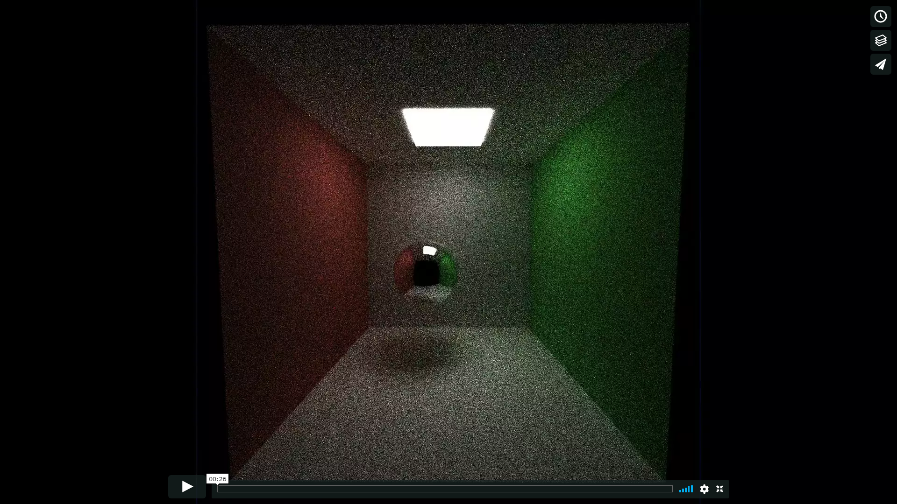
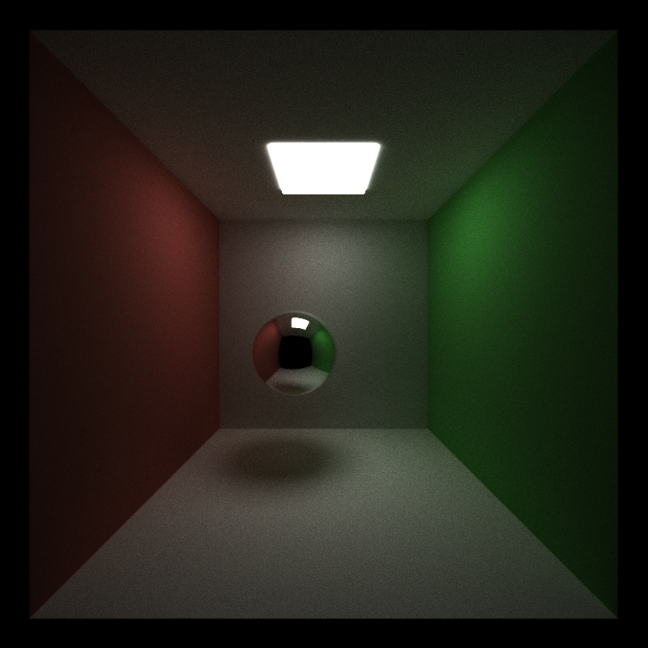
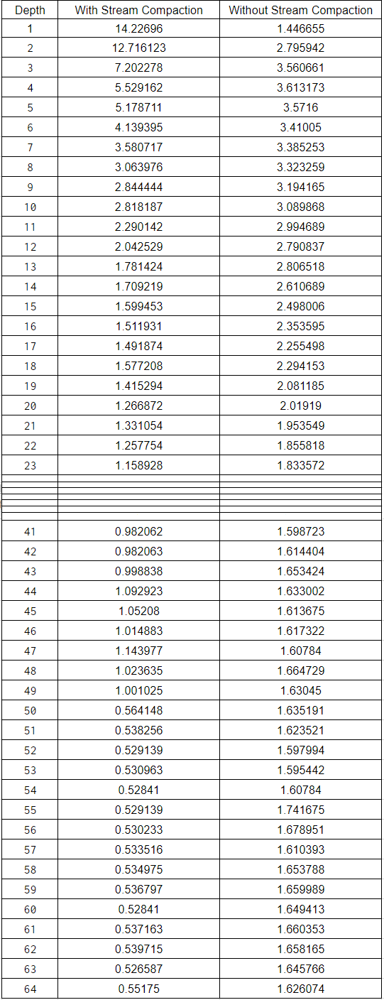
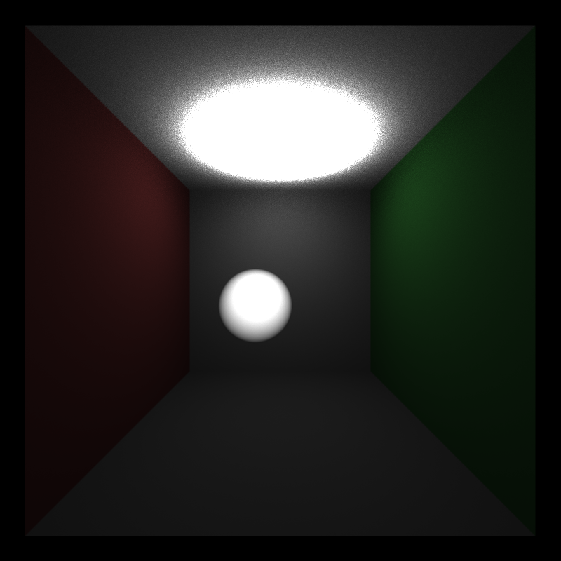

CUDA Path Tracer
================

**University of Pennsylvania, CIS 565: GPU Programming and Architecture, Project 3**

* Aman Sachan
* Tested on: Windows 10, i7-7700HQ @ 2.8GHz 32GB, GTX 1070(laptop GPU) 8074MB (Personal Machine: Customized MSI GT62VR 7RE)

## Overview

In this project, I implemented a simple CUDA Monte Carlo path tracer. Although path tracers are typically implemented on the CPU, path tracing itself is a highly parallel algorithm if you think about it. For every pixel on the image, we cast a ray into the scene and track its movements until it reaches a light source, yielding a color on our screen. Each ray is dispatched as its own thread, for which intersections and material contributions are processed on the GPU.

#### _This simple path tracer runs at about 19 ms/sample._

#### _More Feature filled Path Tracer I made but on the CPU can be found [here](https://github.com/Aman-Sachan-asach/Monte-Carlo-Path-Tracer)._

### Introduction to Monte Carlo Path Tracing

Monte Carlo Path tracing is a rendering technique that aims to represent global illumination as accurately as possible with respect to reality. The algorithm does this by approximating the integral over all the illuminance arriving at a point in the scene. A portion of this illuminance will go towards the viewpoint camera, and this portion of illuminance is determined by a surface reflectance function (BRDF). This integration procedure is repeated for every pixel in the output image. When combined with physically accurate models of surfaces, accurate models light sources, and optically-correct cameras, path tracing can produce still images that are indistinguishable from photographs.

Path tracing naturally simulates many effects that have to be added as special cases for other methods (such as ray tracing or scanline rendering); these effects include soft shadows, depth of field, motion blur, caustics, ambient occlusion, and indirect lighting, etc.

Due to its accuracy and unbiased nature, path tracing is used to generate reference images when testing the quality of other rendering algorithms. In order to get high quality images from path tracing, a large number of rays must be traced to avoid visible noisy artifacts.

## Features

### Naive Integration Scheme

_Anti-Aliased render of a cornell box scene using the naive integration scheme_

A Naive brute force approach to path tracing. This integrator takes a long time and a large number of samples per pixel to converge upon an image. There are things that can be done to improve speed at which the image converges such as Multiple Important Sampling but these add biases to the image. Usually these biases are very good approximations of how the brute force approach would result. 
#### I talk more about Multiple Important Sampling [here](https://github.com/Aman-Sachan-asach/Monte-Carlo-Path-Tracer).

### Stream Compactionfor Inactive Ray Culling

For each iteration of our path tracer we dispatch kernels that do some work. At each depth of an iteration, we always dispatch a kernel with a number of threads that equals the number of pixels being processed. This is wasteful! After every ray bounce there are a number of rays that terminate. This can be because they exit the scene without hitting anything in it, or they can hit a light and terminate. We no longer need to process those rays and issue threads for them the but the ray is still dispatched in a kernel at every depth (up until a maximum depth). In order to remedy this, we can use stream compaction at every bounce to cull rays that we know have terminated and are no longer active. This means we will have fewer threads to dispatch for every depth of a single sample, which will allow us to keep more warps available and finish faster at increasing depths.

One would expect this to give us a drastic improvement in speed, but here are the timings of a single sample with and without stream compaction on the Cornell Box scene.

As can be seen here, stream compaction starts off terribly but at depth 8 becomes faster than processing without stream compaction. Stream compaction helps more and more with increasing depth values. At a depth of 64 it becomes more than 3 times as fast to process an iteration of the pathtracer! The initial terrible impact of stream compaction is likely because the overhead for performing stream compaction cant be justified in our incredibly simple scene. The scene has no complex materials (both lambert and specular are but a few lines of computation) nor tons of geometry (the cornell box scene has 7 objects) or really anything that would make it complex. Stream compaction could play a powerful roll in making a path tracer fast but the overhead it brings is hard to justify in an incredibly simple path tracer only going to a small depth for ray bounces. 

### Material Sorting

Another optimization we can do is to sort our rays at each depth by material type. The motivation behind this is to avoid warp divergence and also bring about memory coherency to improve caching and reduce global memory access. Consider a megakernel that processes the shading of all possible materials in our path tracer. A switch statement can be used to determine what type of material our ray intersects before calling a function that will process the material. This switch statement is the source of a possible divergence in which each thread in a warp is processing a different kind of material, leading to a sequential processing for each thread within the warp. Furthermore, imagine if the materials in our path tracer were complex and had properties defined via texture maps. Everytime a thread needs information it would have to load in a part of that texture from global memory, but every thread in the warp could have a different material and so there would be way too many calls to global memory.

To fix this, we can sort the active rays in the scene by material type. This minimizes warp divergence and leads to fewer global memory calls and memory coherency. In more detail, this means that if a scene has n types of materials, we can only have up to n-1 warp divergences. Sorting by material should give us significant gains when looking at the bigger picture, but we can expect that sorting will only slow down our simulation because of the simplicity of our materials. Lambertian and Reflective surfaces are entirely computation based materials and contain very few lines of code to execute. What we expect is what we get, material sorting leads to ridiculous 6 times slower path tracer.

### First Bounce Caching

For every sample rays are generated from the camera and go into the scene. But for every sample these rays go to the exact same point in our scene (if there isn't anti-aliasing). So we can cache the result of this intersection during the first sample and then just keep reusing the cached intersection results for every new iteration. This optimization results in our path tracer being marginally faster, however if we had a more complex scene this could result in significant savings. 

There is a way to avoid losing the benefits of anti-aliasing while doing this sort of first bounce caching. What would happen is that instead of anti-aliasing being completely random jittering we could make the jittering a repeating loop of fixed values. The first iteration jitters by 0.0 in both x and y, the next by 0.5 in x, the next by 0.5 in y, ... , the fifth by 0.0  in both x and y again. In this way if we increase our caching memory expenditure we can continue to keep anti-aliasing.

### Anti-Aliasing

Anti-Aliasing is a really cool feature that costs us almost nothing (infact, our average timing over 500 samples came out to be a sliver of a hair faster than without it). Antialiasing can be implemented by jittering the initial ray cast from the camera between samples. We do this by generating a random x and y offset for a ray within the context of a single pixel. This allows us to generate rays that don't always hit the same initial intersection, which can cause jagged edges in our renders. With an added random jitter, we can see smoother results, noteably on the edges of the sphere and the corners of the Cornell Box.

### Depth of Field

_Depth of Field Exaggerated_

_Subtle Depth Of Field_

Another easy feature that can yield interesting visual results is depth of field. This allows us to model the camera as if it had a lens with a specific radius and focal distance. We assume the lens to be infinitely thin and specify a distance that we want to be in focus. With this information, we generate a random sample on a disk of the same radius as the lens and use it as an offset from the original ray towards the focal point. The technique I implemented is just an approximation for the actual math. At a high level the origin of the ray is shifted to from a sampled point on the camera lens, and the ray direction is changed depending upon the focal distance and thickness of the lens.

Depth of field barely costs us anything in terms of run time.

### Direct Lighting Integration Scheme

_cornell box with a sphere light using the direct light integration scheme_

_cornell box with a sphere light using the naive integration scheme for reference_

The Direct Lighting Integration scheme has no Global Illumination because it simply ignores secondary bounces of the ray once it hits something in the scene. It is essentially Light Important Sampling. It is an interesting feature because it lays the ground work for a full lighting integration scheme, which uses a variety of importance sampling techniques (through Multiple Importance Sampling) to produce beautiful renders after a small number of samples per pixel. 

Because the direct Lighting Integration Scheme stops after the first bounce it runs incredibly fast in comparison to our naive integration scheme.

## Controls

* Esc to save an image and exit.
* S to save an image. Watch the console for the output filename.
* Space to re-center the camera at the original scene lookAt point
* left mouse button to rotate the camera
* right mouse button on the vertical axis to zoom in/out
* middle mouse button to move the LOOKAT point in the scene's X/Z plane

### Depth of Field Controls 

* Q (+ve change) and W (-ve change) adjust the radius of the camera lens by 0.1 units
* E (+ve change) and R (-ve change) adjust the focal distance by 0.5 units

## Bloopers

_Everything was a specular surface. whoops_